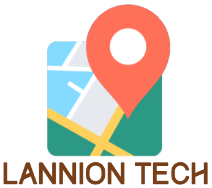

# Road Concept - A powerfull road traffic simuator !


> Projet de génie logiciel en 3ème année de formation IMR à l'ENSSAT Lannion.

## Pré-requis au projet
Pour pouvoir compiler et éxécuter le projet en local sur votre poste, les dépendances suivantes sont nécéssaires :
* [Oracle JDK8] - Le simulateur ainsi que l'API permettant d'y accéder sont développés en Java
* [Maven] - Ces deux projets utilisent le gestionaire de projet Maven
* [MongoDB] - Les données liés à l'affichage des cartes sont stockés dans une base NoSQL MongoDB

## Comment déployer localement le projet ?

Récupérer le projet à l'aide du dépôt git hébergé sur GitHub
```sh
$ git clone git@github.com:Webrom/Road-Concept.git
```
Se placer dans le dossier ```developper-bin```
```sh
$ cd developper-bin/
```
Démarrer la base de données MongoDB. En fonction de votre système d'exploitation :
GNU/Linux Ubuntu
```sh
$ ./start_MongoDB_Mac.sh
```
Apple mac OS
```sh
$ ./start_MongoDB_Ubuntu.sh
```
Lors de la première éxécution, il est possible de devoir donner les droits d'éxécutions aux scripts :
```sh
$ chmod u+x start_MongoDB_[Mac|Ubuntu].sh
```

A ce stade, il reste à compiler la partie serveur du projet et à déployer le serveur HTTP. Pour cela :
```sh
$ ./deploy.sh
```
Ce script va :
    * Build [Road Concept Core]
    * Build [Road Concept API]
    * Déployer le serveur HTTP [Vert.x], écoutant par défaut sur le port ```8080```
    
La documentation de l'API est disponible sur ```http://localhost:8080/doc```

En mode "developpement", le projet est configuré pour utiliser une base de données SQL embarquée (SQLite3). Il est possible de modifier la configuration pour utiliser une base de données PostgreSQL.


**Free Software, Hell Yeah!**

[//]: # (These are reference links used in the body of this note and get stripped out when the markdown processor does its job. There is no need to format nicely because it shouldn't be seen. Thanks SO - http://stackoverflow.com/questions/4823468/store-comments-in-markdown-syntax)


   [Maven]: <https://maven.apache.org/>
   [Oracle JDK8]: <http://www.oracle.com/technetwork/java/javase/downloads/jdk8-downloads-2133151.html>
   [MongoDB]: <https://www.mongodb.com/>
